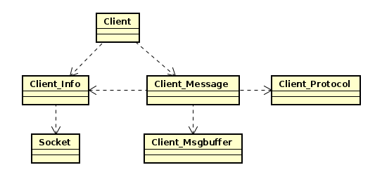
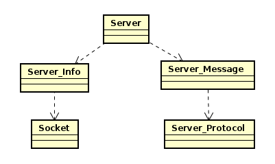
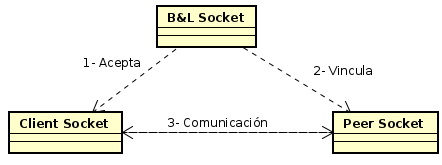

# <center> TP1 </center>
# <center> Protocolo DBUS </center>

### <center> BOTTA, Guido Tomas </center>

### <center> Padron: 102103 </center>

### <center> Enlace a Github: https://github.com/guidobotta/tp1-taller </center>

# Introducción

&nbsp;&nbsp;&nbsp;&nbsp; El presente trabajo practico fue realizado con la finalidad de incorporar conceptos de comunicación cliente-servidor a través de la utilización de Sockets TCP.

&nbsp;&nbsp;&nbsp;&nbsp; Se desarrollo una implementación del sistema entre procesos y llamadas a procedimientos remotos llamado D-BUS. Se implementaron tanto la aplicación de cliente como la de servidor.

# Aclaraciones

&nbsp;&nbsp;&nbsp;&nbsp; No leer los esquemas como diagrama UML. Son simplemente una representación de las dependencias de cada objeto.

# Desarrollo

## Socket TPC

&nbsp;&nbsp;&nbsp;&nbsp; Para este trabajo, se utilizó el socket tipo TPC. El tipo TPC trabaja unicamente con bytes, es decir, envía y recibe bytes. 

&nbsp;&nbsp;&nbsp;&nbsp; A diferencia de otros tipos, TCP garantiza que los bytes enviados llegaran en el mismo orden, sin repeticiones y sin pérdidas del otro lado. Sin embargo, uno de los problemas de TCP es que no garantiza que todos los bytes sean enviados en una sola llamada, por lo que se deberá recurrir a multiples llamados a la función `send`.

&nbsp;&nbsp;&nbsp;&nbsp; Para la solución a este problema, se implemento un TDA Socket, en el cual se implementaron las funciones con el objetivo de facilitar la tarea al usuario. Tanto en las funciones `send` como `rcv` se trataron los posibles problemas de no haber enviado o recibido todos los bytes deseados. La solución para el caso del `rcv` es la siguiente:

```
int socket_receive(socket_t *self, char *buffer, size_t length, int flags){
    size_t bytes_recv = 0;
    size_t status = 1;
    
    while ((bytes_recv < length) && (status != 0)){
        status = recv(self->socket, &(buffer[bytes_recv]), length, flags);
        
        if (status == -1){
            printf("Error: %s\n", strerror(errno));
            return -1;
        }

        bytes_recv += status;
    }
    
    return (int)bytes_recv;
}
```

&nbsp;&nbsp;&nbsp;&nbsp; El usuario debe pasar como parámetro el socket, buffer, longitud y flags, al igual que en la función `rcv`. Pero a diferencia de la función original, el problema de tener que realizar multiples envíos se soluciona con el `while` dentro de la función `socket_receive`.

&nbsp;&nbsp;&nbsp;&nbsp; En cuanto a la función `send`, la solución es exactamente la misma, pero tratando los bytes enviados en vez de recibidos.

## Protocolo DBUS

&nbsp;&nbsp;&nbsp;&nbsp; El protocolo que se utilizó en este trabajo es una versión simplificada del protocolo DBUS. Este protocolo simplificado se utiliza para enviar de forma específica los mensajes a través de la comunicación de sockets.

&nbsp;&nbsp;&nbsp;&nbsp; El protocolo tiene dos partes:

* **Header**: El header lleva la información del endianness, el tipo de mensaje, flags, longitud del cuerpo, numero de serie del mensaje y un array con información de los distintos parámetros. El formato del header es el siguiente:

```
        BYTE, BYTE, BYTE, BYTE, UINT32, UINT32, ARRAY of STRUCT of (BYTE,VARIANT)
```

1. 1er byte: indica el endianness. 'l' para little-endian, 'b' para big-endian.

2.  2do byte: indica el tipo de mensaje. En este trabajo se utilizó solo el tipo método que es el 0x01.

3. 3er byte: indica flags, no utilizados en este trabajo.

4. 4to byte: versión del protocolo.

5. 1er entero: longitud en bytes del cuerpo​.

6. 2do entero: un número serie incremental para identificar el mensaje.

7. Array: un array de longitud variable con los parámetros necesarios según el tipo de mensaje. Posee el siguiente formato:

    - Un entero UINT32 con la longitud del array.

    - Por cada parámetro:

        - Un byte indicando el tipo de parámetro.
        - Un byte en 1.
        - Un byte indicando el tipo de dato.
        - Longitud del dato en bytes. La longitud no toma en cuenta el padding del último elemento.
        - El parámetro con su respectivo padding. Este último elemento no se debe agregar si el parámetro es una firma.

* **Body**: El body lleva la información de las firmas. Se compone de un entero UINT32 con la longitud de la firma seguido de la firma terminada en `'\0'` sin padding.

## Aplicación Cliente

&nbsp;&nbsp;&nbsp;&nbsp; La aplicación cliente tiene la función de conectarse a un servidor, de ip y puerto pasados por parámetro al ejecutar; recibir uno o más mensajes, provenientes de una entrada `stdin` o de un archivo de entrada especificado en la ejecución; convertir el mensaje en bytes con el formato correspondiente al protocolo DBUS; y enviar dicho mensaje formateado al servidor. Si el servidor recibió correctamente el mensaje, el cliente recibirá e imprimira un mensaje `'OK\n'` proveniente de dicho servidor.

&nbsp;&nbsp;&nbsp;&nbsp; La forma de ejecución de la aplicación cliente es la siguiente:

```
./client <host> <puerto> [<archivo de entrada>]
```

&nbsp;&nbsp;&nbsp;&nbsp; La estructura del cliente esta formada por diferentes objetos:

- socket: es un tda socket que facilita la utilización del socket para el usuario.

- client_info: contiene la información del socket, ip y puerto para manejar la conexión entre el cliente y el servidor.

- client_message: contiene la información del mensaje enviado por el usuario. Este además necesita del client_info para poder enviar el mensaje al servidor.

- client_msgbuffer: es un buffer utilizado por el client_message para recibir la entrada del usuario. Se encarga de leer de a 32 bytes la entrada y de almacenar la línea leida en el cliente_message.

- client_dbus_protocol: es un objeto protocolo que se encarga de convertir el mensaje de client_message a un formato soportado por el protocolo DBUS.



## Aplicación Servidor

&nbsp;&nbsp;&nbsp;&nbsp; La aplicación servidor tiene la función de abrir un servidor en el ip pasado por parámetro. Luego se pone a la espera de que una aplicación cliente se conecte consigo. Una vez conectada con la aplicación cliente, el servidor recibe uno o más mensajes provenientes del cliente con el formato del protocolo DBUS. Una vez recibido el mensaje, se imprimirá por pantalla con el siguiente formato:

```
* Id: <id en hexadecimal, 4 dígitos, con prefijo "0x">
* Destino: <destino>
* Ruta: <path>
* Interfaz: <interfaz>
* Metodo: <método>
```

Y, en caso de tener alguna firma el mensaje, se agrega:

```
* Parametros:
    * <parametro1>
    * <parametroN>
```

Una vez recibido e impreso el mensaje por pantalla, el servidor le enviará un mensaje de confirmación `'OK\n'` al cliente.

La forma de ejecución de la aplicación servidor es la siguiente:

```
./server <puerto>
```

La estructura del servidor esta formada por diferentes objetos:

- socket: el mismo que utiliza el cliente.

- server_info: contiene la información de los dos sockets (el de `bind and listen` y el `peer`) y del puerto donde se abre el servidor.

- server_message: contiene la información del mensaje recibido. Necesita de server_dbus_protocol para su creación.

- server_dbus_protocol: se encarga de crear el server_message a través del mensaje de bytes con formato del protocolo DBUS recibido desde el cliente.



## Conexión Cliente-Servidor

&nbsp;&nbsp;&nbsp;&nbsp; Para lograr establecer una conexión cliente-servidor es importante tener en cuenta dos factores:

1. Primero debe iniciarse el servidor, y luego ejecutar el cliente.

2. Tanto el cliente como el servidor deben conectarse al mismo puerto.

&nbsp;&nbsp;&nbsp;&nbsp; La aplicación servidor cuenta con dos sockets. Uno encargado de conectarse y escuchar conexiones entrantes (`bind and listen`), y otro que será el encargado de enviar y recibir mensajes con el socket cliente, el socket `peer`.

&nbsp;&nbsp;&nbsp;&nbsp; Del lado del servidor se cuenta con un único socket, que se conectará con el socket `peer` una vez que el otro socket lo acepte.



&nbsp;&nbsp;&nbsp;&nbsp; Una vez establecida la conexión, se ejecuta el siguiente ciclo:

|   |                     Cliente                     |                          Server                         |
|:-:|:-----------------------------------------------:|:-------------------------------------------------------:|
| 1 |  Recibe mensaje y lo convierte a formato DBUS.  |          Se mantiene a la espera para recibir.          |
| 2 |           Envía el mensaje formateado.          |              Recibe el mensaje formateado.              |
| 3 |       Se mantiene a la espera para recibir      | Convierte el mensaje formateado y lo imprime por stdin. |
| 4 | Recibe el mensaje de confirmación y lo imprime. |         Envia el mensaje de confirmación 'OK\n'.        |
| 5 |                Vuelve al paso 1.                |                    Vuelve al paso 1.                    |

# Conclusiones

&nbsp;&nbsp;&nbsp;&nbsp; Al trabajar con sockets TCP y el protocolo DBUS se puede entender lo complejo que puede llegar a ser el manejo de datos cliente-servidor. 

&nbsp;&nbsp;&nbsp;&nbsp; Este trabajo se realizó con una versión simplificada del protocolo DBUS. Sin embargo, la dificultad del desarrollo no fue baja, lo que muestra que trabajar con ciertos protocolos no es una tarea sencilla y se debe hacer con mucha precaución.